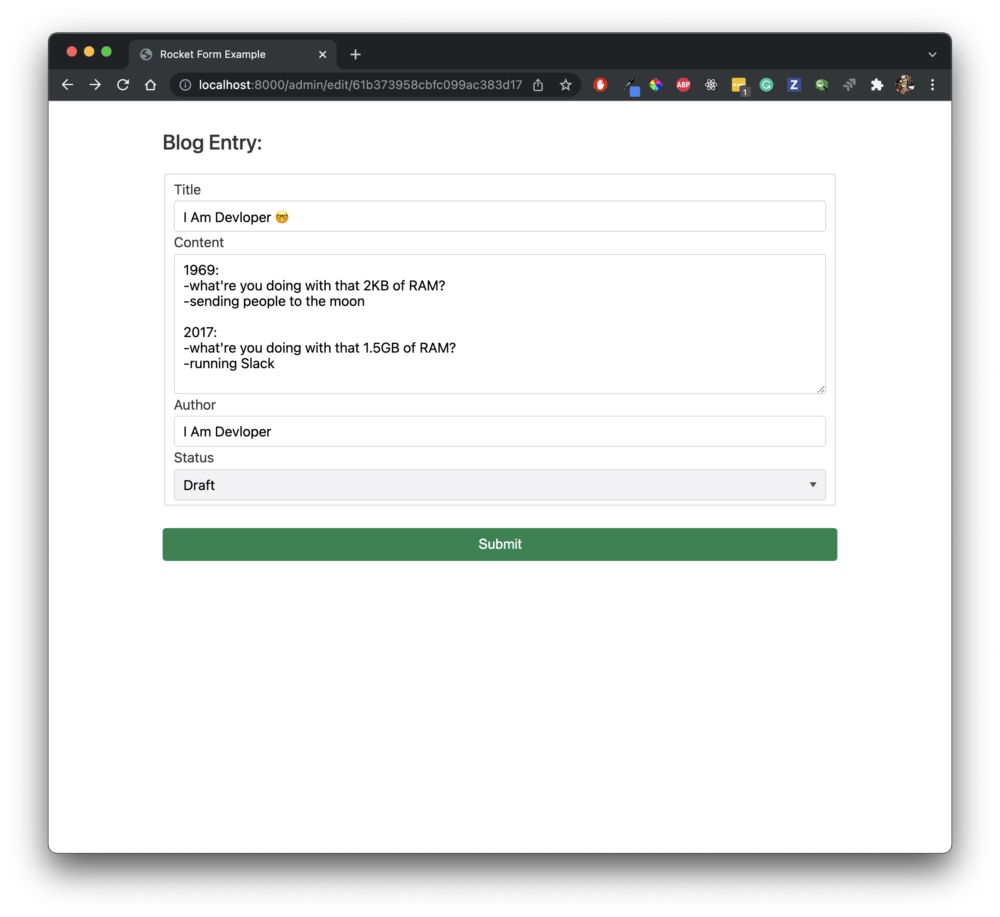

A demo blog post engine written in Rust, using [Rocket](https://rocket.rs/) and [MongoDB](mongodb.com)

# Quick Start

- Setup a new MongoDB cluster https://cloud.mongodb.com/ create a new database and obtain the rust connection string (under Database/Connect)
  example (`mongodb+srv://<user>:<password>@XXXX.mongodb.net/myFirstDatabase?retryWrites=true&w=majority`)

- Create a database `rust_blog_engine`

- Add a collection `authorization` containing authorized users id (Google user id)
```Javascript
{
    "_id": "116710526826489061000",
    "email": "nabil.hachicha@gmail.com",
    "name": "Nabil Hachicha"
}
```

- Add a collection `blogs` which will persist our blog posts entries.
  


- Setup a Google OAuth2 API and add the `client_id` and `client_secret` inside the [Rocket.toml](/Rocket.toml) file.

- Start the engine using `cargo run` and providing the MongoDB connection string
```Shell
MDB_URL="mongodb+srv://<user>:<password>@XXXX.mongodb.net/myFirstDatabase?retryWrites=true&w=majority" cargo run 
```

# Preview

### Home


### Login


### Admin


### New Blog


### Edit Blog
